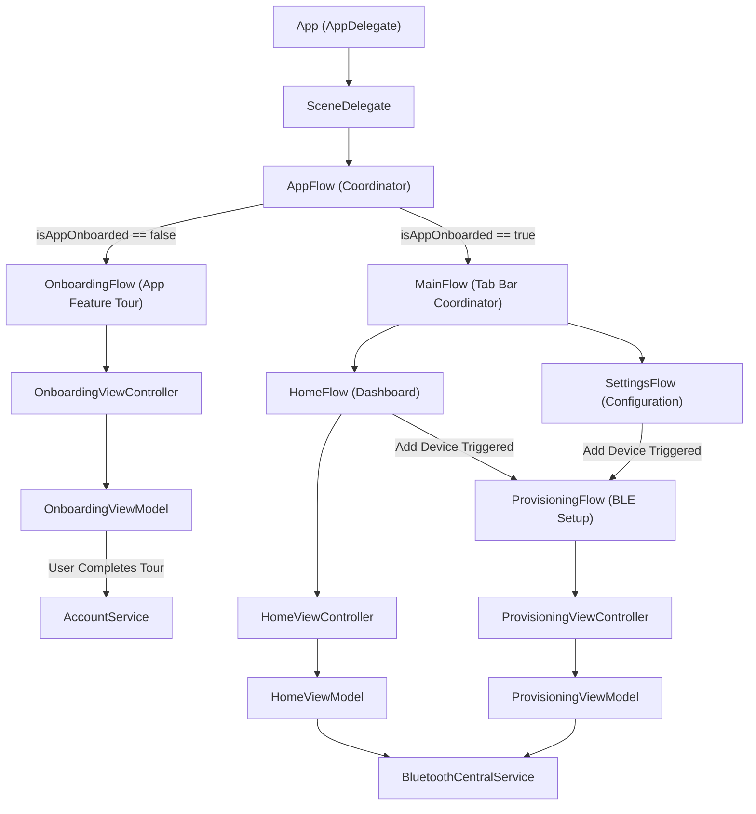
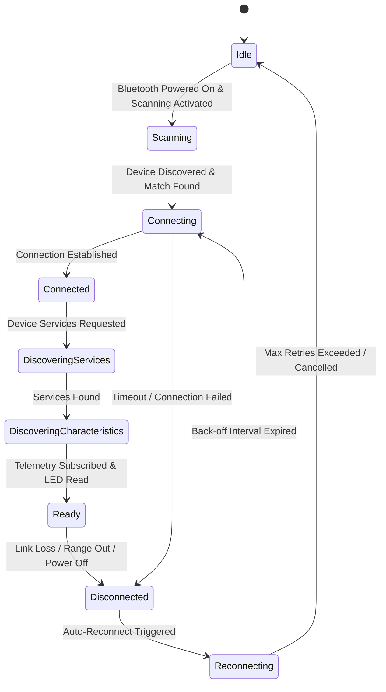

# Architecture Design

This document details the architectural guidelines, concurrency models, dependency injection layout, and resilience mechanisms implemented in the **IoT-Link** ecosystem.

> **Note:** This document describes the target architecture. The onboarding module, the `BluetoothCentralService` central (scan → connect → discover), and the macOS peripheral simulator (`iot-link-simulator`) are implemented; components such as `ProvisioningFlow` and the telemetry dashboard are designed but not yet built.

---

## 🏗️ Architectural Overview

IoT-Link uses a structured Clean Architecture pattern utilizing the **Coordinator (Flow) Pattern**, **MVVM**, **Swinject Dependency Injection**, and **Swift Concurrency**.



---

## 🚦 Navigation & Coordination Flows

The application's navigation is divided into clear, single-responsibility coordinators:

### 1. AppFlow (Root Coordinator)
* **Purpose**: Coordinates the top-level window layout.
* **Logic**: Checks `accountService.isAppOnboarded`. If false, displays `OnboardingFlow`. Once completed (or if true initially), displays `MainFlow`.

### 2. OnboardingFlow (Welcome Walkthrough)
* **Purpose**: Presents the user with the app's features and request permissions (e.g. system notifications, Bluetooth access permissions).
* **BLE Mechanics**: Does **not** perform any BLE pairing or communication. 
* **Completion**: Once the walkthrough slides are finished, calls `accountService.completeAppOnboarding()` and signals `finished` back to `AppFlow`.

### 3. MainFlow (Tab Bar Controller)
* **Purpose**: Manages the tab bar interface containing the `HomeFlow` and `SettingsFlow`.

### 4. HomeFlow & Telemetry Dashboard
* **Purpose**: Coordinates the telemetry dashboard view (`HomeViewController`).
* **Logic**: Exposes status widgets. If no device is currently provisioned/connected, it displays an empty state prompt with an "Add Device" button.
* **Trigger**: Tapping "Add Device" launches the `ProvisioningFlow`.

### 5. ProvisioningFlow (BLE Device Setup)
* **Purpose**: Performs BLE device scanning, selection, connection, and credential writing.
* **Flow**:
  1. Presents `ProvisioningViewController` showing available BLE Peripherals advertising the custom UUID.
  2. Once a device is chosen, presents the Wi-Fi credentials form.
  3. Translates credentials to bytes, performs the write transaction, and listens for the validation handshake.
  4. Upon success, dismisses itself and returns control to the calling flow, transitioning the dashboard to the connected telemetry state.

---

## 🧩 Module Pattern (Action-Driven MVVM)

Each UI module (`Onboarding`, `Home`, `Settings`, …) follows a strict unidirectional data-flow contract built from four files: `*Model`, `*View` (protocols), `*ViewModel`, and `*ViewController` (which also hosts the SwiftUI `*ViewUI`).

### 1. View ↔ ViewModel Contract
The View and ViewModel communicate only through `Input`/`Output` protocols — never by holding concrete references. The `ViewController` conforms to the `Output` side; the `ViewModel` conforms to the `Input` side and is bound via `bind(output:)`.

```swift
protocol OnboardingViewInput {
    func bind(output: OnboardingViewOutput)
    func send(_ action: OnboardingViewAction)
}

protocol OnboardingViewOutput: AnyObject {
    var steps: PassthroughSubject<OnboardingViewSteps, Never> { get }
}
```

### 2. Unidirectional Actions
The View never mutates state directly. Every user intent is expressed as an `Action` enum case and dispatched through a single `send(_:)` entry point. The ViewModel is the only writer of the `Model`, whose stored properties are `private(set)` and mutated exclusively through named setters.

```swift
enum OnboardingViewAction {
    case completeOnboardingTapped
    case nextPageTapped
    case set(currentPageIndex: Int)
    case viewDidLoad
}

func send(_ action: OnboardingViewAction) {
    switch action {
    case .completeOnboardingTapped: handleCompleteOnboardingTapped()
    case .nextPageTapped: handleNextPageTapped()
    case let .set(currentPageIndex): model.set(currentPageIndex: currentPageIndex)
    case .viewDidLoad: break
    }
}
```

Even SwiftUI two-way bindings are funneled through actions rather than mutating the model directly:

```swift
TabView(selection: Binding(
    get: { viewModel.model.currentPageIndex },
    set: { viewModel.send(.set(currentPageIndex: $0)) }
)) { … }
```

### 3. Flow Coordination via `steps`
Both Views and Flows expose a Combine `PassthroughSubject` named `steps`. A ViewModel signals navigation-worthy events (e.g. `.finished`) up to its owning Flow, which decides where to route next — keeping navigation logic out of the module entirely.

---

## 🧵 Concurrency & Thread Safety

`CoreBluetooth` is notorious for blocking UI drawing thread cycles if callbacks execute on the Main Queue. Compounding this, the project builds with `-default-isolation=MainActor` (Swift's approachable-concurrency mode), so any unannotated type is inferred `@MainActor` — which collides with CoreBluetooth's background delegate callbacks. The `BluetoothCentralService` resolves both with an **actor + delegate-proxy** design.

### 1. Actor-Owned Central
`DefaultBluetoothCentralService` is an `actor` that owns the `CBCentralManager`, the connection state machine, the discovered-peripheral map, and the cached characteristics. All CoreBluetooth *calls* (`scanForPeripherals`, `connect`, `discoverServices`, …) are made from actor-isolated methods, and the manager runs on a dedicated background queue.
```swift
private let centralQueue = DispatchQueue(label: "com.iotlink.bluetooth.central", qos: .userInitiated)
private let proxy = CentralDelegateProxy()

init() {
    centralManager = CBCentralManager(delegate: proxy, queue: centralQueue)
    wireProxy()
}
```

### 2. `nonisolated` Delegate Proxy
CoreBluetooth's delegate callbacks fire on the central queue, so they cannot be handled directly by a `@MainActor`-inferred type. A thin `nonisolated` NSObject — `CentralDelegateProxy` — conforms to `CBCentralManagerDelegate`/`CBPeripheralDelegate` and forwards each callback to a `@Sendable` closure the actor installs at construction. Non-`Sendable` CoreBluetooth objects (`CBPeripheral`, `CBService`) are wrapped in `UncheckedSendable` to cross the boundary; the invariant is that they are only ever dereferenced on the central queue or the actor's executor.
```swift
proxy.onDiscover = { [weak self] peripheral, rssi in
    Task { await self?.handleDiscover(peripheral.value, rssi: rssi) }
}
```

### 3. State Exposure via Combine
The service exposes state through `CurrentValueSubject`-backed publishers (so late subscribers replay the latest value), mirroring the `steps` subject pattern used across the codebase. The subjects are `nonisolated(unsafe)` and only ever `send(...)` from inside the actor. An `AsyncStream` is reserved for the high-frequency telemetry stream in a later milestone.
```swift
nonisolated var statePublisher: AnyPublisher<BluetoothState, Never> {
    stateSubject.eraseToAnyPublisher()
}
```

### 4. Main Actor Transition
ViewModels (already `@MainActor`) subscribe to these publishers and route updates into their model through named setters, keeping the model's stored properties `private(set)`.
```swift
func subscribeToTelemetry() {
    Task { @MainActor in
        for await telemetry in bluetoothService.telemetryStream {
            // Mutation is routed through a named setter on the model,
            // keeping its stored properties `private(set)`.
            model.set(telemetry: telemetry)
        }
    }
}
```

> **Convention:** shared, thread-agnostic helpers (e.g. `Optional`/`Sequence` extensions, `trace`, the `UserDefaults` wrappers) are explicitly marked `nonisolated` so they remain callable from any isolation domain rather than being inferred `@MainActor`.

---

## 💉 Dependency Injection (Swinject)

Dependencies are registered in `ServiceAssembly.swift` and resolved dynamically through a container to prevent tight coupling.

* `BluetoothCentralService` is registered in `ServiceAssembly` with `.container` scope (acting as a shared singleton service during the app's lifecycle).
* Consuming ViewModels (`ProvisioningViewModel`, `HomeViewModel`) will declare `BluetoothCentralService` as a constructor parameter once those modules are wired in later milestones.

```swift
// ServiceAssembly.swift
container.register(BluetoothCentralService.self) { r in
    DefaultBluetoothCentralService()
}
.inObjectScope(.container)
```

### Naming Convention: `Default<Protocol>`
Every injectable dependency is defined as a protocol, with its production implementation prefixed `Default` — e.g. `AccountService` → `DefaultAccountService`, `AppFlow` → `DefaultAppFlow`, `OnboardingFlow` → `DefaultOnboardingFlow`. Consumers depend only on the protocol, so the concrete type is swappable (e.g. with a mock) purely through the assembly registration.

---

## 🏭 Model Construction (Builder Pattern)

Model default state is produced by a dedicated caseless-`enum` builder rather than inline literals, keeping the `Model` declarative and its seed data easy to swap or mock. The model exposes the builder via a `static let builder` alias and defaults its initializer parameters to the builder's output.

```swift
struct OnboardingModel {
    private(set) var currentPageIndex: Int
    private(set) var pages: [Page]

    init(currentPageIndex: Int = 0,
         pages: [Page] = Self.builder.makeDefaultPages()) {
        self.currentPageIndex = currentPageIndex
        self.pages = pages
    }
}

enum OnboardingModelBuilder {
    static func makeDefaultPages() -> [OnboardingModel.Page] { … }
}
```

---

## 🔄 BLE State Machine & Auto-Reconnection

### State Machine Lifecycle
The Bluetooth central transition flow is structured as follows:



### 📉 Exponential Reconnection Back-Off Resiliency
When a peripheral disconnects unexpectedly, the system implements an automated exponential back-off reconnection loop. This prevents spamming the radio and draining battery resources on both the iOS device and the peripheral.

#### Reconnection Formula:
$$\text{Delay}_n = \text{Base Delay} \times 2^n + \text{jitter}$$

* \(n\): The current reconnection attempt index (\(0, 1, 2, \dots\)).
* \(\text{Base Delay}\): Initial delay, e.g., `2.0 seconds`.
* \(\text{jitter}\): A small randomized value to prevent sync collisions on multiple reconnecting clients.

```swift
func handleDisconnect(peripheral: CBPeripheral) {
    guard currentAttempt < maxAttempts else {
        self.state = .disconnected
        return
    }
    
    let baseDelay: TimeInterval = 2.0
    let delay = baseDelay * pow(2.0, Double(currentAttempt)) + Double.random(in: 0...0.5)
    
    Task {
        try await Task.sleep(for: .seconds(delay))
        self.connect(to: peripheral)
    }
}
```
