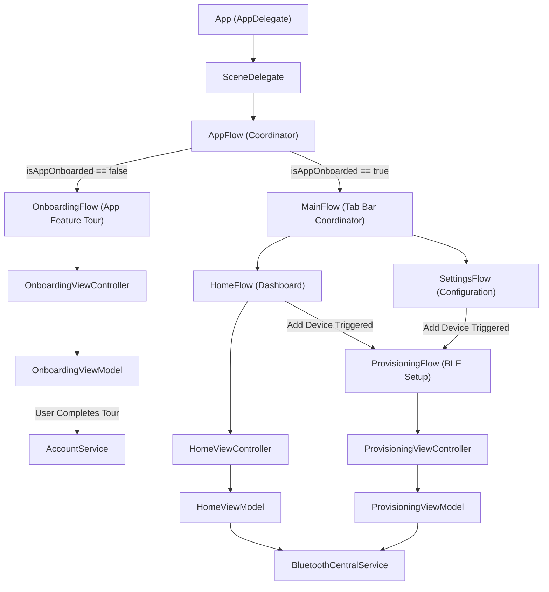
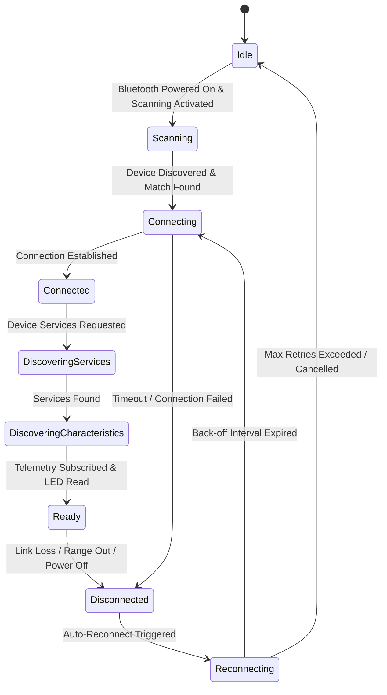

# Architecture Design

This document details the architectural guidelines, concurrency models, dependency injection layout, and resilience mechanisms implemented in the **IoT-Link** ecosystem.

> **Note:** This document describes the target architecture. Some components (e.g., `BluetoothCentralService`, `ProvisioningFlow`) are designed but not yet implemented in the codebase.

---

## 🏗️ Architectural Overview

IoT-Link uses a structured Clean Architecture pattern utilizing the **Coordinator (Flow) Pattern**, **MVVM**, **Swinject Dependency Injection**, and **Swift Concurrency**.



---

## 🚦 Navigation & Coordination Flows

The application's navigation is divided into clear, single-responsibility coordinators:

### 1. AppFlow (Root Coordinator)
* **Purpose**: Coordinates the top-level window layout.
* **Logic**: Checks `accountService.isAppOnboarded`. If false, displays `OnboardingFlow`. Once completed (or if true initially), displays `MainFlow`.

### 2. OnboardingFlow (Welcome Walkthrough)
* **Purpose**: Presents the user with the app's features and request permissions (e.g. system notifications, Bluetooth access permissions).
* **BLE Mechanics**: Does **not** perform any BLE pairing or communication. 
* **Completion**: Once the walkthrough slides are finished, calls `accountService.completeAppOnboarding()` and signals `finished` back to `AppFlow`.

### 3. MainFlow (Tab Bar Controller)
* **Purpose**: Manages the tab bar interface containing the `HomeFlow` and `SettingsFlow`.

### 4. HomeFlow & Telemetry Dashboard
* **Purpose**: Coordinates the telemetry dashboard view (`HomeViewController`).
* **Logic**: Exposes status widgets. If no device is currently provisioned/connected, it displays an empty state prompt with an "Add Device" button.
* **Trigger**: Tapping "Add Device" launches the `ProvisioningFlow`.

### 5. ProvisioningFlow (BLE Device Setup)
* **Purpose**: Performs BLE device scanning, selection, connection, and credential writing.
* **Flow**:
  1. Presents `ProvisioningViewController` showing available BLE Peripherals advertising the custom UUID.
  2. Once a device is chosen, presents the Wi-Fi credentials form.
  3. Translates credentials to bytes, performs the write transaction, and listens for the validation handshake.
  4. Upon success, dismisses itself and returns control to the calling flow, transitioning the dashboard to the connected telemetry state.

---

## 🧵 Concurrency & Thread Safety

`CoreBluetooth` is notorious for blocking UI drawing thread cycles if callbacks execute on the Main Queue. The architecture enforces strict queue separation:

### 1. Private Central Queue
All `CBCentralManager` events and delegate callbacks run on a dedicated background dispatch queue.
```swift
let centralQueue = DispatchQueue(label: "com.iotlink.bluetooth.central", qos: .userInitiated)
centralManager = CBCentralManager(delegate: self, queue: centralQueue)
```

### 2. Thread Transition Boundary
To prevent UI stuttering and data-race warnings, the transition from background threads to UI updates is managed strictly via Swift Concurrency `@MainActor` annotations:
* **Background Process**: Raw byte slicing, parsing, and endianness conversions occur inside `BluetoothCentralService` on the background queue.
* **Stream Bridge**: The service exposes states via Combine `Publisher` or `AsyncStream`.
* **Main Actor Transition**: The ViewModels receive these updates and compile them for the views inside tasks scheduled explicitly on the `@MainActor`.

```swift
// Bridging CoreBluetooth queue to UI Main Actor
func subscribeToTelemetry() {
    Task { @MainActor in
        for await telemetry in bluetoothService.telemetryStream {
            // updates observable state safely on @MainActor
            self.model.currentTemperature = telemetry.temperature
            self.model.currentHumidity = telemetry.humidity
        }
    }
}
```

---

## 💉 Dependency Injection (Swinject)

Dependencies are registered in `ServiceAssembly.swift` and resolved dynamically through a container to prevent tight coupling.

* `BluetoothCentralService` is registered in `ServiceAssembly` with `.container` scope (acting as a shared singleton service during the app's lifecycle).
* `ProvisioningViewModel` and `HomeViewModel` declare `BluetoothCentralService` as a constructor parameter.

```swift
// ServiceAssembly.swift
container.register(BluetoothCentralService.self) { r in
    DefaultBluetoothCentralService()
}
.inObjectScope(.container)
```

---

## 🔄 BLE State Machine & Auto-Reconnection

### State Machine Lifecycle
The Bluetooth central transition flow is structured as follows:



### 📉 Exponential Reconnection Back-Off Resiliency
When a peripheral disconnects unexpectedly, the system implements an automated exponential back-off reconnection loop. This prevents spamming the radio and draining battery resources on both the iOS device and the peripheral.

#### Reconnection Formula:
$$\text{Delay}_n = \text{Base Delay} \times 2^n + \text{jitter}$$

* \(n\): The current reconnection attempt index (\(0, 1, 2, \dots\)).
* \(\text{Base Delay}\): Initial delay, e.g., `2.0 seconds`.
* \(\text{jitter}\): A small randomized value to prevent sync collisions on multiple reconnecting clients.

```swift
func handleDisconnect(peripheral: CBPeripheral) {
    guard currentAttempt < maxAttempts else {
        self.state = .disconnected
        return
    }
    
    let baseDelay: TimeInterval = 2.0
    let delay = baseDelay * pow(2.0, Double(currentAttempt)) + Double.random(in: 0...0.5)
    
    Task {
        try await Task.sleep(for: .seconds(delay))
        self.connect(to: peripheral)
    }
}
```
